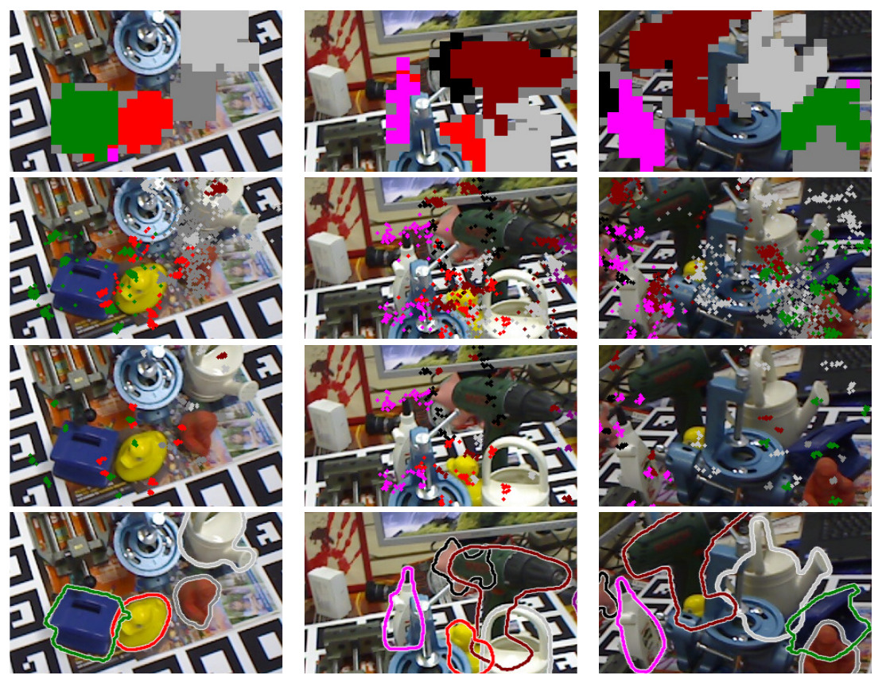

# Introduction


The most recent trend in estimating the 6D pose of rigid objects has been to train deep networks to either directly regress the pose from the image or to predict the 2D locations of 3D keypoints, from which the pose can be obtained using a PnP algorithm. In both cases, the object is treated as a global entity, and a single pose estimate is computed. As a consequence, the resulting techniques can be vulnerable to large occlusions. 

In this paper, we introduce a segmentation-driven 6D pose estimation framework where each visible part of the objects contributes a local pose prediction in the form of 2D keypoint locations. We then use a predicted measure of confidence to combine these pose candidates into a robust set of 3D-to-2D correspondences, from which a reliable pose estimate can be obtained. We outperform the state-of-the-art on the challenging Occluded-LINEMOD and YCB-Video datasets, which is evidence that our approach deals well with multiple poorly-textured objects occluding each other. Furthermore, it relies on a simple enough architecture to achieve real-time performance.


Figure 1: Overall workflow of our method. Our architecture has two streams: One for object segmentation and the other to regress 2D keypoint locations. These two streams share a common encoder, but the decoders are separate. Each one produces a tensor of a spatial resolution that defines an SxS grid over the image. The segmentation stream predicts the label of the object observed at each grid location. The regression stream predicts the 2D keypoint locations for that object. 



Figure 2: Outputs of our two-stream network. (a) The segmentation stream assigns a label to each cell of the virtual grid superposed on the image. (b) In the regression stream, each grid cell predicts the 2D keypoint locations of the object it belongs to. Here, we take the 8 bounding box corners to be our keypoints.


Figure 3: Combining pose candidates. (a) Grid cells predicted to belong to the cup are overlaid on the image. (b) Each one predicts 2D locations for the corresponding keypoints, shown as green dots. (c) For each 3D keypoint, the n=10 2D locations about which the network is most confident are selected. (d) Running a RANSAC-based PnP on these yields an accurate pose estimate, as evidenced by the correctly drawn outline. 


Figure4: Occluded-LINEMOD results. In each column, we show, from top to bottom: the foreground segmentation mask, all 2D reprojection candidates, the selected 2D reprojections, and the final pose results. Our method generates accurate pose estimates, even in the presence of large occlusions. Furthermore, it can process multiple objects in real time.

# Citing

```
@inproceedings{hu2019segpose,
  title={Segmentation-driven 6D Object Pose Estimation},
  author={Yinlin Hu and Joachim Hugonot and Pascal Fua and Mathieu Salzmann},
  booktitle={CVPR},
  year={2019}
}
```
